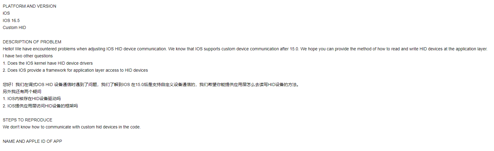

## 介绍
一个用于与Flutter应用程序的HID设备通信的跨平台插件。

## 平台
- [x] Windows
- [x] MacOS
- [x] Android
- [ ] IOS

其中 Android 参见 hid_android, Windows 和 MacOS 参见 hid_desk。

## 关于IOS不支持HID说明
我们在开发IOS时遇到了一些问题，基于这些我们跟apple的研发工程师进行了沟通。
以下是我们的邮件来往记录
### 23年11月14日
我们向官方提出了两个问题
1. IOS内核存在HID设备驱动吗
2. IOS提供应用层访问HID设备的框架吗



### 23年11月16日
官方审核了我们的请求并给予回复。
回复内容如下
```
鉴于目前的系统配置，没有支持的方法来实现所需的功能。
如果您希望Apple考虑在iPadOS中添加HID支持，请通过Feedback提交您的建议请求
```


### 23年11月27日

我们询问官方未来有没有支持HID的计划，
官方回复我们不支持，但对于未来是否支持不是很明确。


## 结尾
通过上述得知IOS是不支持hid通信的，未来我们会持续跟进IOS的相关生态。
也欢迎对hid感兴趣的同学提交PR。