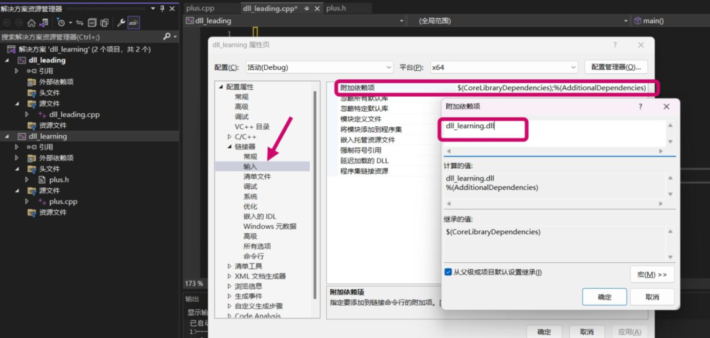

# hid_desk

这是一个Flutter的HID插件，用于macos和windows平台。  

本项目的所有代码都是基于[hidapi-0.14.0](https://github.com/libusb/hidapi)第三方库支撑的。  

原理：hidapi实际上也是基于原生的IOkit核心库开发的。

## 安装
想要使用我们的插件运行项目，必须按照如下说明安装。

### macos

#### 1. 获取hidapi动态库
在终端输入
```
brew install hidapi
```
查看hidapi库位置
```
brew info hidapi
```
复制hidapi库到用户目录，这样方便我们在链接时快速查找
```
cd /opt/homebrew/Cellar/hidapi/0.14.0
copy -r lib /Users/nonagon
```
#### 2. 在你的项目里链接动态库

##### 在 Xcode 中打开 yourapp/macos/Runner.xcworkspace。  

```
拖动 hidapi.dylib 到您的 Runner/Frameworks。
```

##### 点击 Runner 然后进入 Build Phases 标签。
```
拖动 libyourlibrary.dylib 到 Copy Bundle Resources 列表。

在 Embed Libararies 下，检查 Code Sign on Copy。

在 Link Binary With Libraries 下，设置状态为 Optional。（我们使用动态链接，不需要静态链接）
```

##### 点击 Runner 然后进入 General 标签页。

```
拖动 libyourlibrary.dylib 到 Frameworks, Libararies and Embedded Content 列表中。

选择 Embed & Sign。
```

##### 点击 Runner 然后进入 Build Settings 标签页。
```
在 Search Paths 部分，配置 Library Search Paths 确保 libyourlibrary.dylib 的路径包括在内。
```

#### 运行
运行 flutter run macos 然后检查您的本地方法的调用结果。


### windows
#### 点击下方下载动态库
[hidapi动态库](https://github.com/libusb/hidapi/releases/download/hidapi-0.14.0/hidapi-win.zip)

#### 使用visual studio打开项目
右击windows项目->使用visual studio启动

#### 引入链接文件
在工程标头处右击->点击属性按钮->链接器->输入->附加依赖项->输入lib文件名称，这里填入"hidapi.dll"。这里的意义在于告诉链接器，有一个lib文件需要链接。


#### 填入dll文件地址
在告诉链接器需要链接hidapi.dll文件后，还需要告诉链接器该文件的地址，所以这里填入dll文件地址


#### 加入函数声明
工程标头->C/C++栏->附加包含目录->输入hidapi头文件的文件夹目录


#### 运行
运行 flutter run windows 然后检查您的本地方法的调用结果。

## 开始
```dart 
import 'package:hid_android/hid_android.dart';
import 'dart:async';

  StreamSubscription? _usbData;
  StreamSubscription? _usbStatus;
  @override
  void initState() {
    // TODO: implement initState
    super.initState(); 
    init(); 
  }
  void init() async {
    await _hidAndroidPlugin.init();
    await _hidAndroidPlugin.initialize();
  }
  void getData() {
    _usbData?.cancel();
    _usbData = _hidAndroidPlugin.useData().stream.listen((event) {
        //event为usb设备发送的数据
    });

    _usbStatus?.cancel();
    _usbStatus = _hidAndroidPlugin.usbStatus().stream.listen((event) {
         //event为usb设备是否插入手机
    });
  }
```
